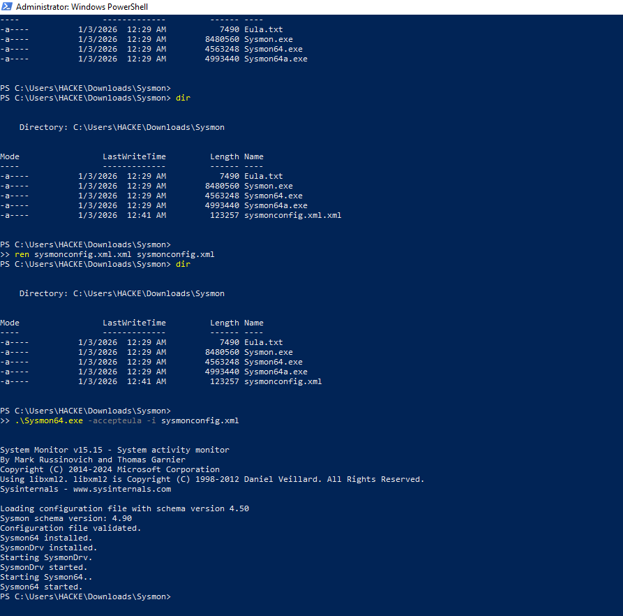
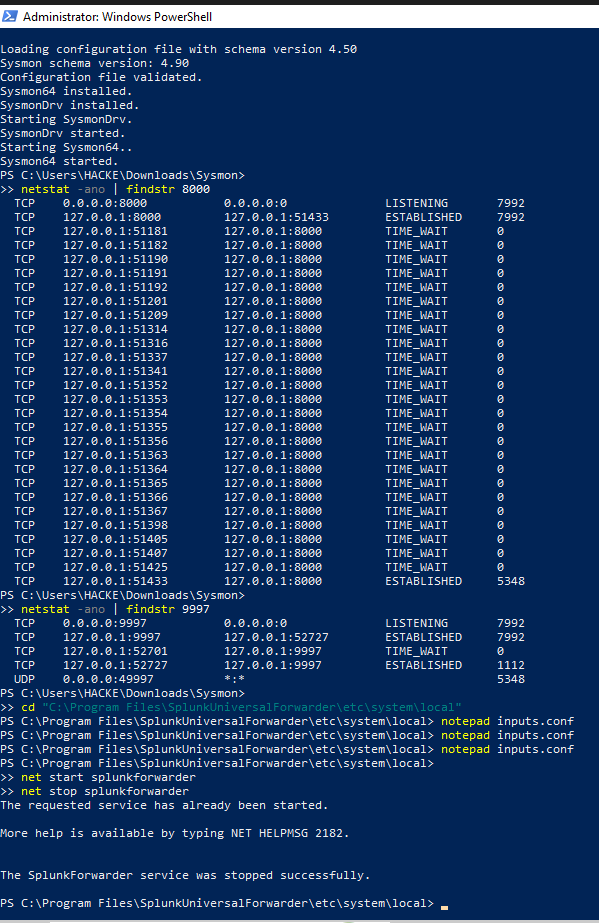

# 🛡️ Splunk SOC Detection Lab

End-to-end SOC detection lab using **Windows Event Logs (Event ID 4688)**, **Sysmon**, and **Splunk** to detect **LOLBins** mapped to the **MITRE ATT&CK framework**.

---

## 🛡️ Objective

This lab demonstrates a **real-world SOC detection pipeline**, from Windows telemetry generation to SIEM-based detection and investigation.

Key objectives:

- Monitor Windows process creation (**Event ID 4688**)
- Enrich telemetry with **Sysmon**
- Detect **Living-off-the-Land Binaries (LOLBins)**
- Perform **command-line and parent–child analysis**
- Map detections to **MITRE ATT&CK**
- Build analyst-ready Splunk searches

---

## 🛡️ SOC Architecture


**Description**

This diagram illustrates the end-to-end SOC detection architecture used in this lab.

Windows endpoints generate **Security Event Logs (4688)** and **Sysmon telemetry**, which are collected by the **Splunk Universal Forwarder** and forwarded to **Splunk Enterprise** for detection, investigation, and MITRE ATT&CK mapping.

---

## 🔍 Data Sources

- Windows Security Event Logs (Event ID 4688)
- Sysmon (Process Create, Command Line)
- Splunk Universal Forwarder

---

## 🛡️ Detection Use Cases

The following techniques and LOLBins are monitored:

- PowerShell abuse
- Rundll32 LOLBin execution
- Regsvr32 abuse
- Mshta command execution
- Certutil file download abuse
- WMI and script interpreter abuse

---

## 🛡️ Detection Walkthrough (Step-by-Step)

### 1️⃣ Architecture Overview  
**Screenshot:** 

  

High-level view of the SOC pipeline from endpoint to SIEM.

---

### 2️⃣ Sysmon Installed and Running  
**Screenshot:**:- 



Confirms Sysmon is installed and actively generating enhanced telemetry.

---

### 3️⃣ Splunk Universal Forwarder Running  
**Screenshot:** 


  
Validates log forwarding from the Windows endpoint to Splunk.

---

### 4️⃣ Event ID 4688 Ingested  
**Screenshot:**

  

Shows raw Windows process creation events successfully indexed.

---

### 5️⃣ Sysmon Process Creation Events  
**Screenshot:** 

  

Displays enriched process telemetry including image paths and command lines.

---

### 6️⃣ Command-Line Fields Extracted  
**Screenshot:**

  

Extracted fields include:
- `NewProcessName`
- `CommandLine`
- `ParentProcessName`

---

### 7️⃣ LOLBin Detection – Rundll32  
**Screenshot:** 


Identifies Rundll32 executions consistent with LOLBin activity.

---

### 8️⃣ Command-Line Analysis  
**Screenshot:** 


Analyzes suspicious command-line arguments associated with LOLBins.

---

### 9️⃣ Parent–Child Process Analysis  
**Screenshot:** 


Visualizes abnormal parent–child process relationships.

---

### 🔟 MITRE ATT&CK Mapping  
**Screenshot:** 

  

Detected activity mapped to MITRE ATT&CK techniques, including:

- **T1059.001 – PowerShell**
- **T1218.011 – Rundll32**
- **T1218.010 – Regsvr32**

🛡️ MITRE ATT&CK Technique Mapping (Explanation)

🔹 T1059.001 – PowerShell

What it is
Abuse of PowerShell, a powerful Windows scripting engine commonly used by attackers for execution, reconnaissance, and post-exploitation.

Why attackers use it

Installed by default on Windows

Highly flexible and powerful

Can execute scripts, commands, and in-memory payloads

Often trusted by security controls

How it appears in this lab

Event ID 4688 process creation events

powershell.exe observed as NewProcessName

Suspicious or interactive command-line usage

Parent processes such as explorer.exe or other system binaries

🔹 T1218.011 – Rundll32

What it is
Abuse of rundll32.exe, a legitimate Windows binary used to execute code within DLL files.

Why attackers use it

Signed Microsoft binary (trusted)

Executes arbitrary DLL functions

Frequently abused to evade application whitelisting

How it appears in this lab

rundll32.exe launched with unusual DLLs

Suspicious command-line arguments

Parent processes such as cmd.exe or unexpected system binaries

🔹 T1218.010 – Regsvr32

What it is
Abuse of regsvr32.exe, normally used to register or unregister DLLs.

Why attackers use it

Trusted Microsoft binary

Can execute code via DLL registration

Historically abused for fileless execution

How it appears in this lab

regsvr32.exe executing DLLs outside standard install paths

Silent execution flags (e.g. /s)

Abnormal parent–child process relationships

🛡️ Why This Matters

Mapping detections to MITRE ATT&CK allows SOC analysts to:

Understand attacker behavior, not just raw logs

Standardize detections across environments

Prioritize alerts based on known adversary techniques

Communicate findings clearly during investigations

This lab demonstrates how raw Windows telemetry can be transformed into threat-informed, MITRE-aligned detections.

---

## 🛡️ Detection Logic

- Event ID 4688 process creation monitoring
- Command-line inspection
- Parent–child process relationship analysis
- LOLBins allow/deny logic
- MITRE ATT&CK technique tagging

---

## 🛠 Tools Used

- Splunk Enterprise
- Splunk Universal Forwarder
- Sysmon
- Windows Event Logging
- Sigma Rules
- MITRE ATT&CK Framework

---

## 📁 Repository Structure

```text
splunk-soc-detection-lab/
├── architecture/
│   └── soc-architecture.png
├── screenshots/
│   ├── 01-architecture-overview.png
│   ├── 02-sysmon-installed.png
│   ├── 03-splunk-forwarder-running.png
│   ├── 04-event-4688-ingested.png
│   ├── 05-sysmon-process-create.png
│   ├── 06-commandline-fields-extracted.png
│   ├── 07-lolbin-rundll32-detection.png
│   ├── 08-commandline-analysis.png
│   ├── 09-parent-child-analysis.png
│   └── 10-mitre-attack-mapping.png
├── spl/
├── sigma/
└── README.md
